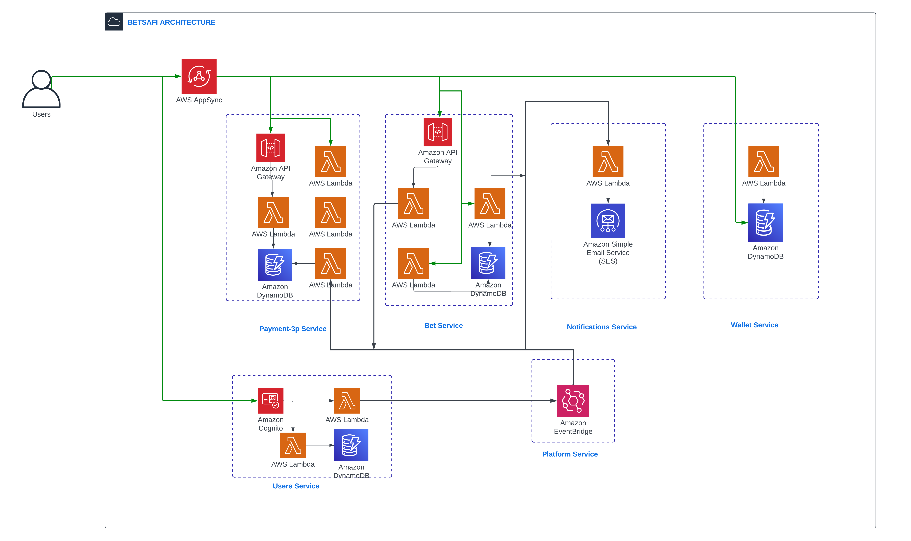

# BETSAFI Serverless Platform

**Status**: _Work-in-progress. Please create issues or pull requests if you have ideas for improvement._

The **BETSAFI Serverless Platform** is an implementation of a serverless backend for a . Functionalities are split across multiple micro-services that communicate either through asynchronous messages over [Amazon EventBridge](https://aws.amazon.com/eventbridge/) or over synchronous APIs.

<!-- ## Getting started -->

<!-- To install the necessary tools and deploy this in your own AWS account, see the [getting started](docs/getting_started.md) guide in the documentation section. -->

## Architecture

### High-level architecture

This is a high-level view of how the different microservices interact with each other. Each service folder contains anarchitecture diagram with more details for that specific service.

  

### Technologies used

**Communication/Messaging**:

- [AWS AppSync](https://aws.amazon.com/appsync/) for interactions between users and the ecommerce platform.
- [Amazon API Gateway](https://aws.amazon.com/api-gateway/) for service-to-service synchronous communication (request/response).
- [Amazon EventBridge](https://aws.amazon.com/eventbridge/) for service-to-service asynchronous communication (emitting and reacting to events).

**Authentication/Authorization**:

- [Amazon Cognito](https://aws.amazon.com/cognito/) for managing and authenticating users, and providing JSON web tokens used by services.
- [AWS Identity and Access Management](https://aws.amazon.com/iam/) for service-to-service authorization, either between microservices (e.g. authorize to call an Amazon API Gateway REST endpoint), or within a microservice (e.g. granting a Lambda function the permission to read from a DynamoDB table).

**Compute**:

- [AWS Lambda](https://aws.amazon.com/lambda/) as serverless compute either behind APIs or to react to asynchronous events.

**Storage**:

- [Amazon DynamoDB](https://aws.amazon.com/dynamodb/) as a scalable NoSQL database for persisting informations.

**Monitoring**:

- [Amazon CloudWatch](https://aws.amazon.com/cloudwatch/) for metrics, dashboards, log aggregation.

### Backend services

| Services                        | Description                                                      |
| ------------------------------- | ---------------------------------------------------------------- |
| [users](users/)                 | Provides user management, authentication, and authorization.     |
| [bet](bet/)                     | Manages all bet operations create,cancel.                        |
| [notifications](notifications/) | Manages user notifications.                                      |
| [payment](payment/)             | Manages payments and interacts with the Daraja API for payments. |
| [wallet](wallet/)               | Manages user wallets.                                            |

### Frontend service

| Services                      | Description                                        |
| ----------------------------- | -------------------------------------------------- |
| [frontend-api](frontend-api/) | User-facing API for interacting with the services. |

### Infrastructure services

| Services              | Description                                             |
| --------------------- | ------------------------------------------------------- |
| [platform](platform/) | Core platform resources for deploying backend services. |

### Shared resources

| Name              | Description                                                                                                |
| ----------------- | ---------------------------------------------------------------------------------------------------------- |
| [docs](docs/)     | Documentation application for all services.                                                                |
| [shared](shared/) | Shared resources accessible for all services, such as common CloudFormation templates and OpenAPI schemas. |
| [tools](tools/)   | Tools used to build services.                                                                              |

## Documentation

See the [docs](docs/) folder for the documentation.

## Contributing

See the [contributing](CONTRIBUTING.md) and [getting started](docs/getting_started.md) documents to learn how to contribute to this project.

## License

This library is licensed under the MIT-0 License. See the LICENSE file.
